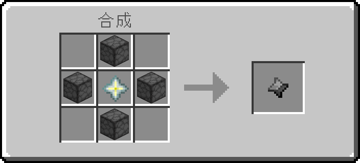

# mc_craft_render — 基岩版合成表渲染器

读基岩版 addon 的 `recipes/*.json` + 资源包纹理，输出**和游戏合成台界面一致**的 PNG 合成表
（面板 + 中文标题 + 槽位 + 灰色箭头 + 26×26 产物格 + 数量角标，方块物品用等轴 3D 立方体渲染）。



```
mc_craft_render/
├─ mcrender/                 # 渲染器（纯 Python + Pillow）
│  ├─ jsonc.py               # 宽容 JSON 解析（BOM / 注释 / 尾逗号 / 多段 JSON）
│  ├─ assets.py              # 物品ID → 纹理（RP → 子包 → 原版；多面纹理；别名/模糊匹配）
│  ├─ icon.py                # 平面图标 + 等轴方块立方体（按输出分辨率栅格化）
│  ├─ fonts.py               # 字模：截图提取字模 + 原版字模页 + 手写 ASCII 数字
│  ├─ glyphs.json            # 从截图里 1:1 还原的 zh_CN 汉字点阵（合成/熔炉/酿造台…）
│  ├─ panel.py               # 面板 / 槽位 / 箭头 sprite
│  ├─ recipes.py             # recipe JSON → 统一结构
│  ├─ render.py              # 布局 + 合成输出
│  └─ cli.py                 # 命令行入口
├─ tools/
│  ├─ verify_reference.py    # 与游戏截图逐像素比对
│  └─ extract_glyphs.py      # 从截图里提取汉字字模
├─ out/                      # 输出（265 张 PNG + _report.md）
└─ README.md
```

## 用法

```powershell
# 任何 Python 3.11+（需要 Pillow）；命令行参数没给就用 config.json 里的值
$py = "python"

# 全量渲染（路径由命令行或 config.json 提供；本程序不内置任何个人路径）
& $py -m mcrender --bp <行为包> --rp <资源包> --out out --scale 4

# 只渲染某几条 / 某类
& $py -m mcrender --filter stone_star --out out
& $py -m mcrender --kind shaped,shapeless --out out
& $py -m mcrender --list                  # 只列配方，不渲染

--scale 4                  # 1 UI 单位 = 几个像素（游戏 GUI scale，默认 4，始终 NEAREST）
--layout modern|classic    # modern = 你现在游戏里的版式（默认，标题居中，面板 176×80）
                           # classic = 你第一张参考图那种紧凑面板（160×80，标题左对齐）
--background none          # none=透明（默认）或 #C6C6C6 / white
--title 合成 --title-size 8
--no-counts
--cube-shading reference   # 用参考图拟合出的方块左右面亮度（默认 vanilla 原版面亮度）
--bp / --rp / --vanilla / --recipes / --out / --report
```

输出保持 `recipes/` 下的目录结构；`out/_report.md` 记录渲染/跳过/缺纹理/警告。

## 分辨率为什么现在不糊了

三条渲染规则，都是照游戏实测的：

| 内容 | 做法 |
| --- | --- |
| 面板 / 槽位 / 箭头 | 按 1 UI 单位 = 1 像素绘制，再整体 NEAREST 放大到 GUI scale（同上表 0.00%~0.6% 误差） |
| **中文标题** | 游戏是把 **16×16 字模直接铺进 8×8 单位字框**（GUI scale 4 时每个字模像素 = 2×2 屏幕像素，笔画 2px 锐利）。之前我先降采样成 8×8 再放大，细节丢一半 → 糊。现在按 `draw_crisp()` 在输出分辨率上贴 16×16 点阵 |
| **物品 / 方块** | 直接在输出分辨率栅格化：16×16 平面图标 NEAREST 放大；方块立方体按 `rotation[30,225,0] scale .625` 在 64×64 上做仿射光栅化，轮廓就是真的 64×64 轮廓，不是 16×16 放大 |

字模来源：samples 包只有 zh_TW / ja_JP 字模页（字形偏小），游戏用的是 zh_CN 全高字形，
所以 `tools/extract_glyphs.py` 从你给的高清截图里把原始 16×16 点阵**精确还原**（截图里字是 2×2 均匀块，
隔点采样即可无损还原），存进 `mcrender/glyphs.json`，优先于字模页使用：

```powershell
& $py -m tools.extract_glyphs <截图.png> "合成" --region 150 16 400 62 --box 203 34
```
（`--box` 是标题 8 单位字框的左上角像素坐标；不给就自动搜索。想要更多字，用别的截图按同样方式提取即可。）

## 校验结果

```powershell
& $py -m tools.verify_reference out\stone_star.png --layout modern
```

对比你最新那张合成台高清截图（GUI scale 4，面板外沿在 (11,12)），**只统计双方都是 GUI 色调的像素**
（物品贴图区域跳过，因为你的截图挂了光影类资源包）：

```
compared 203112 GUI pixels of 215600 (94.2%)
pixel mismatches: 1676 = 0.825%
```

分区误差：背景面板 0.00%、箭头 **0.00%**、空格子 0.62%（只有槽位 4 个角）、标题 0.78%、
面板边框 2.3~2.9%（四角 1~2px 倒角差异，游戏面板宽度本身是 175.75 单位不是整数）。
剩下的 1676 个差异全部落在右上角倒角那几列。

## 支持范围与已知取舍

- **配方类型**：`recipe_shaped`、`recipe_shapeless`、`recipe_furnace`（含 blast_furnace / smoker）、
  `recipe_stonecutter`、`recipe_smithing_transform`、`recipe_brewing_mix/container`。265 条全部出图。
- **版式**：
  - **所有合成统一 3×3 合成台**（不管是 2×2 还是 3×3 的配方），图样/材料从网格**左上角**开始排。
  - **无序合成**（`recipe_shapeless`）在面板**右下角**画原版那个🔀交叉箭头标记（点阵来自你的截图，见 `mcrender/sprites.json`）。
  - 熔炉（输入+燃料空槽+火焰+箭头+产物）、切石机、锻造台（模板/底材/附加）各有版式；
    **酿造台按游戏真实界面重建**（实测你截图的坐标）：燃料空槽在左上、材料槽在上中、三个药水瓶子槽在下排（中间那个低 7 单位，
    与游戏一致）、槽间用管道连接、右侧竖版进度箭头、左下是燃料盘管和燃料条（贴图取自原版 `textures/ui/brewing_*.png`）。
    材料槽 = 配方 `reagent`，**只有中间那个瓶子槽放产物药水**（左右两个只留空瓶底纹，与游戏一致）。
  - 标题按配方 `tags` 取（合成 / 熔炉 / 高炉 / 烟熏炉 / 切石机 / 锻造台 / 酿造台 / 石头工作台 / 石头转换台 / 石头锻造台）。
- **方块模型（非纯方块）**：会读 BP 方块 JSON 的 `minecraft:geometry` + `minecraft:material_instances`，
  以及 RP 的 `models/**/*.geo.json`，按 Bedrock 几何格式真实渲染：
  骨骼父子链 / `pivot` / `rotation`（Z→Y→X）、立方体 `origin`/`size`/`inflate`/`mirror`、
  盒式 UV `[u,v]` 和逐面 UV `{"north":{"uv":…,"uv_size":…}}`、`texture_width/height`；
  输出分辨率下用 **z-buffer 逐像素光栅化**，面亮度按旋转后的法线取（上 1.0 / 南北 0.8 / 东西 0.6）。
  你包里三个自定义模型（`stone_smithing_table`、`mimic_stone_flower`、`ancient_stone_totem_doll`）现在都是真模型视图；
  其余方块是 `minecraft:geometry.full_block`，走普通立方体。
- **原版特殊形状内置库**（`mcrender/shapes.py`）：原版把台阶/楼梯/火把/花草这些形状写死在游戏里，
  addon 读不到模型文件，所以这些形状是本工具自带的，按名字/后缀自动匹配，渲染时走同一套几何管线：
  台阶 `_slab`、楼梯 `_stairs`、地毯 `_carpet`、压力板、雪层、睡莲、活板门、**十字花草**（蒲公英/虞美人/郁金香/各类树苗/草/蘑菇/下界疣/甜浆果…）、
  火把/红石火把/灵魂火把、灯笼、锁链、末地烛、避雷针、营火、栅栏/栅栏门、墙、玻璃板/铁栏杆、
  门、告示牌、旗帜、梯子、脚手架、按钮、拉杆、花盆、铁轨、铁砧、蛋糕、箱子、漏斗、炼药锅、堆肥桶、
  酿造台、切石机、砂轮、讲台、钟、头颅、仙人掌、竹子、床、可可豆等（约 40 种）。
  名字匹配不上时按后缀猜（`*_slab` / `*_stairs` / `*_door` / `*_wall` / `*_pane` / `*_rod` …）；
  想加新形状直接在 `shapes.py` 的 `SHAPES` 里补一条（单位：16=1 格，x/z 居中，y 从方块底部起，每个面给 16×16 贴图上的 UV 矩形）。
  纹理同时支持 `.png` 和 `.tga`。
- **药水**：`potion_type:regeneration` 取 `potion_bottle_regeneration` 等专用图标，不做液体染色。
- **物品标签**（`minecraft:planks` 等）映射到代表物品（木板→橡木木板、`stone_crafting_materials`→圆石），报告里注明。
- **数量角标**：0-9 是按原版 5×7 度量手写的点阵（samples 包不含 ASCII 字模页），按 GUI scale 放大。
- **方块阴影**：默认用原版面亮度（上 1.0 / 南北 0.8 / 东西 0.6）；你截图里的立方体因为光影包而不同，
  `--cube-shading reference` 可切到从截图拟合的亮度。
- **非立方体方块**（花、火把、铁轨等）走平面图标，名单在 `assets.py` 的 `FLAT_BLOCKS`。

---

## 拖拽用法（推荐）

本目录就是"程序"本体，入口是 **`合成表生成器.bat`**：

1. 把 `recipe json` 文件（或整个 `recipes` 文件夹）**拖到 `合成表生成器.bat` 图标上**；
2. 弹出的窗口里会逐条显示 `✓ 配方ID → 输出图片`；
3. 图片输出到**你在界面里选的输出目录**（`config.json` 的 `out`，首次使用为空，需要自己选），
   并保持 json 所在的子目录结构。

窗口里也能拖（把文件拖进窗口的"拖放区域"），还可以用「选择 JSON 文件…」「选择文件夹…」按钮。
版式（modern/classic）、缩放、方块阴影、输出目录都能在窗口里改，改动会写回 `config.json`。

无窗口批量模式（给 bat/脚本调用）：

```powershell
& C:\Python314\python.exe mcrender_gui.py --headless <json或目录> [...]
```

`config.json` 字段：`bp`（行为包，含 recipes/）、`rp`（资源包）、`vanilla`（原版 samples 包）、
`out`、`scale`(GUI scale)、`layout`(modern/classic)、`cube_shading`(vanilla/reference)。
换 addon 只改这个文件，不用动代码。

---

## 特殊模型 / 草类 → wiki 图标（可关）

游戏里有些方块不是靠模型文件画的：箱子、潜影盒、床、旗帜、告示牌、钟、头颅、饰纹陶罐、末地传送门这些走**专用渲染器**；
草、蕨、海带、藤蔓这类贴图是**灰度图**，靠游戏按生物群系上色 —— 这两种 addon 里都读不到完整信息，所以：

- 这些方块会去 **minecraft.wiki / zh.minecraft.wiki** 取官方库存图标（300px 高清渲染），首次下载后存进
  `wiki_cache/<id>.png`，之后**离线也能用**；取不到才回退到内置几何体/自身渲染。
- 其它所有方块、物品仍然用**你自己的纹理 + 像素渲染**，风格统一。
- `config.json` 的 `wiki_icons`：`auto`（默认，只给上面两类用）/ `always`（所有方块都先试 wiki）/
  `never`（完全不用 wiki，全部本地画）。
- 草/树叶的颜色：优先用 `terrain_texture.json` 里的 `tint_color`（如睡莲 `#208030`），
  否则从原版 `textures/colormap/grass.png`、`foliage.png` 取**平原色**（草地 ≈ #8ABE56、树叶 ≈ #6DAD2C），
  已经是彩色的贴图不会被动。

## 输入：json / 文件夹 / 压缩包

| 拖进来的东西 | 行为 |
| --- | --- |
| `recipe.json` | 用 config.json 里的 BP/RP 出这一条 |
| 含 recipes 的文件夹 | 递归找 json，按 `recipes/` 相对路径输出 |
| 行为包文件夹（有 manifest.json，type=data） | 用它的 recipes + 里面/配置里的 RP |
| 资源包文件夹（type=resources） | 只当纹理来源（单独拖它不会出图） |
| `.mcaddon` / `.mcpack` / `.mcworld` / `.zip` | 解包 → 按 manifest.json 自动分出 BP 和 RP → 出图（世界包里的内嵌包也能认出来） |

## 界面

窗口里可以选 **行为包 BP / 资源包 RP / 输出目录 / 原版包**，以及版式、缩放、方块阴影、wiki 图标开关；
所有选择都会写回 `config.json`，**下次打开还是上次的设置**。拖放区域支持文件、文件夹和上面的压缩包，
拖到 `合成表生成器.bat` 图标上也一样。

---

## 原版资源：本地包 → 缓存 → 官方示例（三合一）

工具需要的原版资源（贴图、`item_texture.json`/`terrain_texture.json`/`blocks.json`、GUI 箭头火焰、colormap、字体）按顺序找：

1. **本地包**：`config.json` 的 `vanilla`（你给的 `Minecraft_samples\resource_pack`），以及任何拖进来的资源包；
2. **本地缓存**：`<工具目录>\vanilla_cache\`（下载过的文件都在这里，之后**离线可用**）；
3. **官方示例包**：`https://github.com/Mojang/bedrock-samples` 的 `resource_pack/`，**缺少什么就下什么**，
   下完进缓存。所以哪怕不填本地包、甚至没有 samples 目录，只要联过一次网就能用。

- GUI 里有「**补全原版资源（联网）**」按钮；命令行 `python mcrender_gui.py --sync-vanilla <行为包目录>`，
  会先把核心文件下好，再**预取该行为包所有配方用到的物品贴图**（省得首次出图一张一张下）。
- `config.json` 的 `vanilla_download`：`true`（默认，允许联网补全）/ `false`（只用本地包 + 缓存）。
- 网络不稳或断网时自动**熔断转离线**（连续失败就本次运行不再联网），不会卡住；
  下不到就回退到内置形状或平面图标，并在日志里报告。
- 只对 `minecraft:` 命名空间的 id 联网：你自己 addon 的物品不会去做无意义的下载。
- 两处缓存的体积都不大（核心文件 0.4 MB，wiki 图标每张几十 KB），随工具目录一起拷走即可。

### 字体说明

官方示例包和你的 samples 都**不含**字形位图（`texts/<语言>/font/glyph_XX.png` 两边都没有），
所以中文标题用的是 `mcrender/glyphs.json`（从你的截图里提取的 16×16 字模）+ 手写 ASCII 点阵，
不需要联网也不需要原版包。

## 压缩包：支持“双重压缩”

有些 `.mcaddon` / `.mcpack` 是**压缩套压缩**（外层 zip 里再放 `.mcpack`/`.zip`，或包在子文件夹里）。
现在解包会**递归**进行（最多 4 层），每一层都按 `manifest.json` 里的 `modules[].type`
（`data` → BP，`resources` → RP）识别，然后把找到的所有 BP 的配方一起出图。实测：外层 `double.mcaddon`
里放 `packs/inner.mcpack` 也能正常出图。

## 导出位置：自动多一层「合成表」文件夹

图片不再直接倒进你选的那个目录，而是放进它下面的 `合成表` 子文件夹：

```
你选的输出目录\
└── 合成表\            ← 所有图片都在这里（含配方子目录结构）
    ├── sacrifice\blood_offering_vial.png
    ├── armors\boots\lv1stone_boots.png
    └── ...
```

- `config.json` 的 `out_subdir` 控制这层文件夹名，**默认 `合成表`**；
- 如果输出目录本身就叫「合成表」（比如 `...\备份\合成表`），**不会再套一层**；
- 想让图片直接放输出目录，把 `out_subdir` 设成 `""` 即可；
- 界面上「输出目录」下面会显示一行「图片会放在：…」，确认最终落点；
- 「打开输出文件夹」按钮直接打开这个 `合成表` 文件夹。

---

## 打包成 exe

工具根目录的 `build_exe.bat`（已装 PyInstaller）会生成两个独立 exe，放在 `发布\`：

| 文件 | 说明 |
| --- | --- |
| `合成表生成器.exe` | 图形界面版，双击即用，**不需要装 Python** |
| `合成表生成器-CLI.exe` | 命令行版（`--headless` / `--sync-vanilla`），带控制台输出 |

- 打包内容：`mcrender` 整个包 + `glyphs.json` / `sprites.json` + **预下好的 `vanilla_cache` / `wiki_cache`**
  （首次运行自动释放到 exe 旁边），所以拿到 exe 就能**离线**出图。
- exe 旁边的 `config.json` 记住设置；缓存也在旁边，整个 `发布\` 文件夹拷走即可移植。
- 注意 exe 旁边要有写权限（配置/缓存写在那里），别放 `C:\Program Files`。

## 结构不同的包：项目式仓库 / 命名空间贴图键

HiddenYears2 这类"**开发仓库**"压缩包（BP + RP + `src/` + `assets/`）暴露了两个问题：

1. **贴图不在 RP 里**：这个 RP 根本没有 `textures/` 目录，贴图和两个索引都放在项目根目录的
   `assets\textures\` 下（构建时才合并进 RP）。现在会自动识别这种情况：
   如果某个包所在目录里**同时存在行为包和资源包**（项目结构），就把旁边的 `assets\`
   这类含 `textures\item_texture.json` 的目录也当作纹理根目录（优先级最低，只补空缺）。
   纯粹放在 `development_resource_packs\` 里的一堆不相干资源包**不会**被吸进来。
2. **贴图键带命名空间**：`"texture": "hiddenyears:crusher_top"`，而 RP/项目的
   `terrain_texture.json` 里正是以 `hiddenyears:crusher_top` 为键 —— 现在能正确命中。
3. **行为包自带 `material_instances` 的整方块**：以前只用 RP 的 `blocks.json`/`terrain_texture`
   猜面贴图，现在**优先用 BP 里写死的面→贴图映射**（`geometry.full_block` 或没写 geometry 时），
   这也是游戏本身的做法。

顺带修了 `totem_of_undying`（贴图文件叫 `totem`）以及全套唱片 `music_disc_* → record_*`。

## 物品 id 与贴图文件名不对应（紫黑方块的根因）

Bedrock 里不少物品的 **id 和贴图文件名不是一回事**，取不到就画成紫黑格。现在按规律补齐了：

| id | 贴图文件 | 规则 |
| --- | --- | --- |
| `bow` / `crossbow` | `bow_standby` / `crossbow_standby` | 显式别名 + 后缀兜底（`_item` `_standby` `_uncast` `_normal` `_empty` `_filled`） |
| `clock` / `compass` | `clock_item` / `compass_item` | 同上 |
| `wooden_sword` … | `wood_sword` … | `wooden_` → `wood_` |
| `golden_helmet` … | `gold_helmet` … | `golden_` → `gold_` |
| `white_dye` … | `dye_powder_white` … | `<颜色>_dye` → `dye_powder_<颜色>` |
| `beef` / `chicken` / `porkchop` / `mutton` | `beef_raw` … | 生肉自动加 `_raw` |
| `powder_snow_bucket` / `tropical_fish_bucket` | `bucket_powder_snow` / `bucket_tropical` | `<x>_bucket` → `bucket_<x>` |
| `wheat_seeds` | `seeds_wheat` | `<x>_seeds` → `seeds_<x>` |
| `oak_sign` / `spruce_sign` / `dark_oak_sign` | `sign` / `sign_spruce` / `sign_darkoak` | 告示牌专用规则 |
| `lapis_lazuli` / `glass_bottle` / `enchanted_golden_apple` / `fermented_spider_eye` / `turtle_scute` … | `dye_powder_blue` / `potion_bottle_empty` / `apple_golden` / `spider_eye_fermented` / `turtle_shell_piece` … | `EXTRA_ALIASES` 表 |

另外：**海带（kelp）、小麦、地狱疣、甜菜根这类"既是植物又是物品"的，用物品贴图**，不再用方块/十字模型
（`wheat`/`beetroot`/`nether_wart`/`kelp` 等 7 个），方块类（火把、蒲公英…）仍然用模型。

离线全量自检：**265 条配方里唯一"取不到贴图"的是 `tag:minecraft:stone_crafting_materials`**
（物品标签，本来就有代表物品映射）；常见原版物品 150 项里只剩 4 项确实没有对应贴图
（`dust`、`firework_star`、`knowledge_book`、`spectral_arrow`，原版样例包就没有这些文件）。

## 旧 data 药水：直接用 wiki 的药水渲染图

原版药水图标是「瓶子贴图 + 灰度 overlay 按药水颜色染色」，我自己配色那版颜色和游戏对不上
（比如夜视药水，游戏/wiki 是绿色，我按 Java 老配色染成了深蓝 ✗）。现在改成：

1. **优先取 wiki 的官方渲染图**：按 `Invicon [Splash|Lingering] Potion of …` 从
   `minecraft.wiki`（16×16，像素风）取图，常见/喷溅/滞留三种瓶子各有对应文件，
   下载后缓存在 `wiki_cache\potion_*.png`，之后离线可用；
2. 英文 wiki 没有的条目再试中文 wiki（32×32）；
3. **完全离线时**才回退到"瓶子 + 染色"的本地合成（颜色表仍是 Java 经典配色）。

`potion_type:regeneration` 的写法同样支持，`long_/strong_` 之类会归到对应基础药水的渲染图。

## 变体（data）与特殊模型的两个修正

- **`data` / `variation` 现在会被解析**：配方里 `{"item": "minecraft:skull", "data": 1}` 这类写法，
  内部记成 `minecraft:skull#1`，再按变体表换成具体物品（`skull` 0~6 →
  骷髅头/凋灵骷髅头/僵尸头/玩家头/苦力怕头/末影龙头/猪灵头），顺带支持羊毛、地毯、染料、混凝土、
  玻璃、木板、原木、树苗、树叶、石头、泥土、砂岩、石砖等常见变体的旧 data 值。
  之前凋灵骷髅配方的输入输出都画成同一个通用"头"，现在是正确的两种头。
- **wiki 图标加了尺寸检查**：wiki 有些页面（比如 `Skull` 这种归类页）的配图是 **2560×1459 的拼图**，
  缩到 16 单位就是一个糊球 —— 现在超过 1000px 的图直接判定不可用并删掉，改用具体变体页面
  （`Skeleton Skull`、`Wither Skeleton Skull` 等，都是干净的 300×300 渲染图）。
- **失水恶魂（`dried_ghast`）**：它和箱子、床一样是游戏里写死的模型，之前被当整方块画成一个怪方块。
  现在优先用 wiki 官方图标；**断网时回退到内置模型** —— 一个 10×10×10 的身体 + 四条触须，
  身体六个面各自用自己的贴图（`dried_ghast_front/back/left/right/top/bottom`），触须用
  `dried_ghast_tentacles`，为此给几何体加了「逐立方体贴图」支持。

## 选择文件夹：BP 与 RP 分开，两个都选好才出图

路径行各自的「选择…」按钮就是文件夹选择器，界面上不再另设重复按钮：

- **行为包 BP 行的「选择…」**：选行为包 → 程序**自动找配套 RP**（先按 `com.mojang` 目录约定
  `development_behavior_packs\X(BP)` → `development_resource_packs\X(RP)`，再按 manifest 里
  `dependencies` 的 uuid 找），找到就自动填进 RP 行；
- **资源包 RP 行的「选择…」**：只切换纹理来源；
- **选完不再自动出图**：BP、RP 都就绪后，点 **「▶ 开始出图（当前 BP + RP 的全部配方）」** 才生成
  —— 只选一边时按钮会提示先补齐另一边，避免自定义贴图查不到而出紫黑方块；
- 拖压缩包（`.mcaddon/.mcpack/.zip`）或拖文件夹仍然**立即出图**（解包出来的 BP/RP 自动配对），行为不变。

## 自定义物品标签

无序配方常写成 `{"tag": "hiddenyears:is_artifact"}` —— 标签本身没有贴图。现在扫描行为包 `items/**/*.json`
时会读 `minecraft:tags` 组件，建立「标签 → 一个成员物品」索引，画图时用那个成员代替，
并在日志里写明「item tag X drawn as Y」。原版的常见标签（木板/原木/石制材料…）仍走内置表。

## 锻造台 UI（对齐游戏）

按游戏界面改：标题 **「升级装备」**（原版 `smithing_table` 标签），左上角画 `textures/ui/smithing_icon.png`
（那把锤子图标），三个槽排成一行并给第一/第三个槽叠上游戏自带的
`templates_slot_overlay.png` / `smithing_material_slot_overlay.png`（虚线框），后面接箭头和产物槽。
自定义工作台（`stone_smithing_table` 等）仍用它们自己的标题。

## 酿造台燃料条

燃料条从"空条"改成 **`brewing_fuel_bar_full.png`**（游戏里那根黄色条），位置大小不变。

## 命名空间写法

`item_texture` 的键有 `<name>`、`<ns>.<name>`（点号）和 `<ns>:<name>`（冒号）三种写法，
查表时三种都会试。**不再为作者的 id 笔误做迁就**：如果配方里写的 id 在包和原版里都不存在
（例如物品声明成 `nj:unstable_golden_spear`、配方却写 `nj:unstable_gold_spear`），
就按缺失处理（画紫黑格），不去猜近似名字。

## 一键补全原版纹理（整包下载，只增不删）

「**补全原版资源（下载全部纹理）**」按钮会把 `item_texture.json` + `terrain_texture.json` 里
引用到的**全部**原版物品与方块纹理（约 **2100+** 个路径）下载到 `vanilla_cache\`，8 线程并发、
带进度日志，**下载后不会被自动删除**。之后出图只读本地，不再联网（速度快很多）。

旁边的「**删除本地纹理缓存**」按钮会弹确认框并显示当前占用体积，确认后清空 `vanilla_cache\`；
删除后回到"缺什么补什么"的按需模式（或直接从你配置的本地原版包读取）。

不点这个按钮时，行为与以前完全一样：**缺什么补什么**。

## 手动选 BP / RP 不会自动出图

路径行的「选择…」只负责设值（BP 会自动找配套 RP 并写进配置、日志给出提示），
必须点 **「▶ 开始出图（当前 BP + RP 的全部配方）」** 才会生成。
拖 json / 文件夹 / `.mcaddon` 进来仍然是立即出图。

## 锻造台 / 酿造台界面按游戏 UI 定义还原

数值取自游戏自带的 `ui/smithing_table_2_screen.json` 与 `ui/brewing_stand_screen.json`：

- **锻造台**：面板加高到 176x104；30x30 的 `smithing_icon.png` 在左上角，标题「升级装备」居中且与图标同高；
  三个 18x18 槽排一行（x=10/28/46, y=56），第一/第三个槽叠 16x16 的模板/材料 overlay；箭头在 x=74，产物槽 26x26 在 (97,52)。
- **酿造台**：弹簧（`brewing_fuel_pipes`）按**原始 30x22** 画不再拉伸；燃料条外框 24x6 在 (60,46)、
  黄色填充 22x4 在 (61,47)，左端正好接上弹簧的管子；**燃料条上方补上 `bubbles_empty/full` 12x30 的气泡**。

## UI 贴图改为内置（不再依赖下载）

`assets\ui\textures\ui\` 里内置了 15 张界面贴图（箭头、火焰、酿造台弹簧/燃料条/管道/气泡、瓶子、
锻造台图标与槽 overlay 等），在查找原版资源时**优先级最高**。所以即使联网下载失败
或被"删除本地纹理缓存"清掉，界面也不会缺件（日志里那两条 `bubbles_*.png missing` 不会再出现）。

## 气泡等元素按游戏 UI 定义摆放

`ui/brewing_stand_screen.json` 里每个元素都是相对屏幕中心的偏移，直接照搬：
弹簧 (-47,-5) 30x22、燃料条 (-23,3) 24x6 + 黄条 22x4、气泡 (-23,-14) 12x30、
**管道用游戏原版 `brewing_pipes`（30x26）**（之前是手画的竖管，会压到燃料条 → 现在不会了）、
箭头 (16,-14) 9x28。

## 切石机界面

单输入槽 (41,30)、大箭头 (72,~32)、26x26 产物槽 (103,26)，行整体在 176 宽面板里居中，
标题「切石机」居中 —— 与游戏截图一致。

## 锻造台标题

标题紧挨左上角的 30x30 工作台图标（x=38），不再拉到面板中间；箭头左移到 x=71，与产物槽留出间距。
**中文标题缺字时**（比如「升级装备」「切石机」）改用系统字体（微软雅黑）在 16x16 单元内渲染后
**二值化**，输出清晰的像素字形，不再是模糊的抗锯齿缩放。

## 机器配方用 tags 决定版式

Bedrock 允许把机器配方写成普通的 `recipe_shapeless` / `recipe_shaped`，只要 `tags` 里写清工作台即可。
你包里的 11 条切石机配方就是这样（`recipe_shapeless` + `tags:["stonecutter"]`），以前会被当成无序合成画成 3×3 ✗。
现在 `tags` 优先决定面板：

| tag | 版式 |
| --- | --- |
| `stonecutter` | 切石机（单输入槽 + 大箭头 + 26×26 产物） |
| `furnace` / `blast_furnace` / `smoker` | 熔炉（输入 + 燃料空槽 + 火焰 + 箭头 + 产物） |
| `smithing_table` | 锻造台（若配方里真给了 template/base/addition） |
| 其它 | 合成台 3×3 |

## 下过一次之后就不再联网（local_only）

「**补全原版资源（下载全部纹理）**」只要**没有失败条目**，就会自动把 `config.json` 的
`local_only` 设为 `true`，之后：

- 原版纹理只从**本地原版包 + `vanilla_cache`** 里找，**完全不再发请求**；
- **wiki 图标**也只读 `wiki_cache`，缓存里没有就直接跳过（不再联网查）；
- 设置行里多了一个勾选框 **「只用本地（不联网）」**，可以手动开关；
- 点了「**删除本地纹理缓存**」会自动把 `local_only` 关掉，回到"缺什么补什么"的模式。

实测（磐石之旅 249 个物品）：

| 模式 | 耗时 | 联网请求 |
| --- | --- | --- |
| `local_only = true` | **0.31 秒** | 0 |
| `local_only = false`（按需补全） | 273 秒 | 有（未命中项要等超时） |

不点"补全原版资源"时 `local_only` 保持 `false`，行为与以前完全一致。

## 「补全原版资源」永远能完成的三个白名单

官方样例包里根本没有这 3 个条目（每次补全都会红着失败 4 次，导致无法进入纯本地模式）：

| 条目 | 处理 |
| --- | --- |
| `textures/items/camera` | 教育版物品，样例包没有 → 列入 `KNOWN_MISSING` |
| `textures/blocks/hanging_pale_moss_middle` | 同上 |
| `textures/blocks/hanging_pale_moss_tip` | 同上 |
| `textures/blocks/cake` | 方块形式的蛋糕贴图，样例包没有；**只认物品形式** `textures/items/cake`（配方卡用不到方块形式）→ 列入 `KNOWN_MISSING` |

`KNOWN_MISSING` 里的条目不算失败（日志只在统计里显示「跳过 4」，不会单独刷一段话）。
所以补全后 **失败数 = 0**，会自动切到 `local_only`；`assets\ui`（内置界面贴图）作为最高优先级
本地目录，而且**打包进 exe 的那一份也会被搜索**（`bundle_root`），所以 exe 旁边缺这个文件夹也不影响出图。

## 原版包支持压缩文件（.zip / .mcpack / .mcaddon）

「原版包」那一行现在可以选**文件夹**，也可以选**压缩文件**。压缩文件不需要解压整包：
用到哪张纹理就当场把那一个成员读出来放进 `vanilla_cache`，所以放一个"只含合成所需纹理的精简包"
也完全够用。

判定有效：压缩文件/文件夹里能找到 `textures/item_texture.json`。
一旦有效，**立刻切到本地模式**（`local_only = true`），不发起任何联网下载。
日志只写两行：

```
原版包（压缩文件）可用，已切到本地模式，不再联网。
原版包无效（找不到 textures/item_texture.json）：<路径>
```

## 下载失败自动重试一次

并发下载结束后，对失败项再**顺序重试一遍**（并发时容易出现成批失败）。
重试日志：`重试 16 个失败项`。重试仍失败的才会留在失败清单里。

## 五处贴图 / 文字问题（本轮修复）

1. **石头工具、骨粉抓到了 wiki 文章插图**（多把锄头/多把剑/骨头）。
   原因：`minecraft:stone_hoe` 之类的条目**不在**样例包那份精简 `item_texture.json` 里，
   本地找不到时回退到 wiki，而 wiki 取的是**条目配图**而不是物品图标。
   现在 ①wiki 只接受"小且接近正方"的图标（≤96px、长宽比 0.55–1.8），
   ②优先按 `Invicon <名称>.png` → `<名称> JE1 BE1.png` → `<名称>.png` 顺序取文件，条目配图放最后。
2. **`ruby_griffin_egg`（HiddenYears）**：配方产物 id 是 `hiddenyears:ruby_griffin_egg`，
   但 RP 的物品贴图键写成 `hiddenyears:egg_ruby_griffin`（词序相反），
   方块贴图又是 `ruby_griffin_egg_stage_0..3` —— **作者命名不一致**，按你的要求不处理。
3. **两种高度的花**（`sunflower` / `lilac` / `rose_bush` / `peony` / `pitcher_plant`）：
   以前走方块模型（灰色十字），现在与 `WIKI_SPECIAL` 一致，取**物品图**。
4. **补全原版资源时按配方再预取一遍**：`sync_all` 只下载索引里列出的贴图，
   石头工具、骨粉这类"直接用文件名引用"的贴图不在索引里。现在补全后会遍历当前 BP 的所有配方，
   把缺的贴图也下下来（日志：`按配方预取贴图…`），这样切到本地模式后才真的不缺件。
5. **中文标题**：缺字时用系统字体渲染，现在把字形**居中并限制在 16×16 单元内**，
   不再出现最后一个字被切掉的情况（`切石机` / `升级装备` / `石头工作台` 都完整）。

## 输出目录与本地模式

`config.json` 的 `local_only` 现在同时受"补全原版资源"和"原版包是否可用"控制；
放了有效的原版包（文件夹或 zip）会立刻切到本地模式。

## 全量审计（磐石之旅 249 个配方物品）

| 场景 | item | block | model | **missing** |
| --- | --- | --- | --- | --- |
| 配置了原版包 | 179 | 46 | 22 | **2**（`dried_ghast`、一个 tag） |
| **没配原版包** | 138 | 20 | 2 | **89** |

"兼容性差"的根源就是第二种：`vanilla` 为空时 89 个物品在本地找不到，
只能靠 wiki 兜底，而 wiki 有时给的是条目配图。
**配置好原版包（文件夹或 zip），或再点一次「补全原版资源」**即可（新版补全会按配方把非索引贴图也下下来）。

## 头/骷髅一族

`minecraft:skull`（无 data）、`minecraft:wither_skull`、`*_head` 以前会退化成"平铺方块贴图"（棕色噪点）。
现在统一归一到骷髅变体 0–6，取 wiki 的物品图标（官方样例包不含任何头部贴图），
内置骷髅模型作为离线兜底。实测 `skull` → 骷髅头、`wither_skull` → 凋灵骷髅头。
